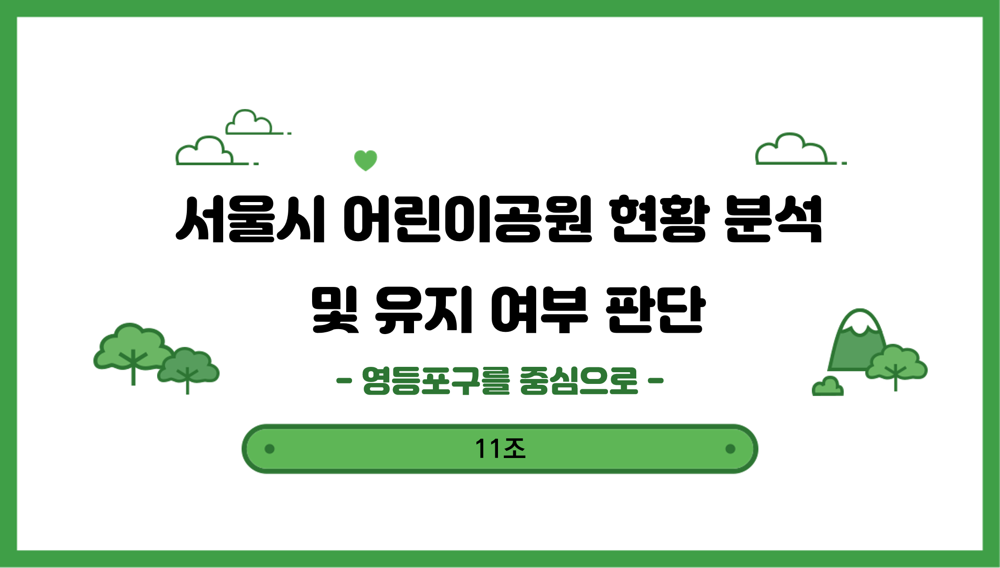
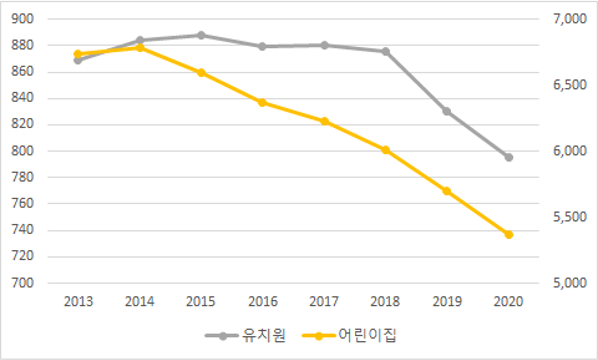
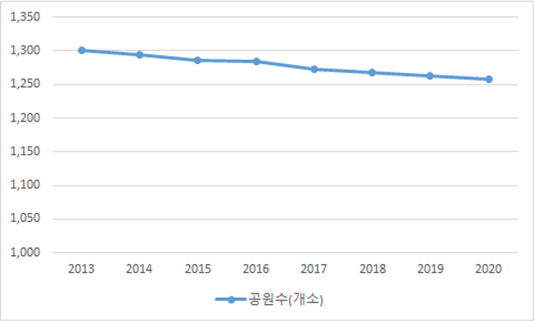
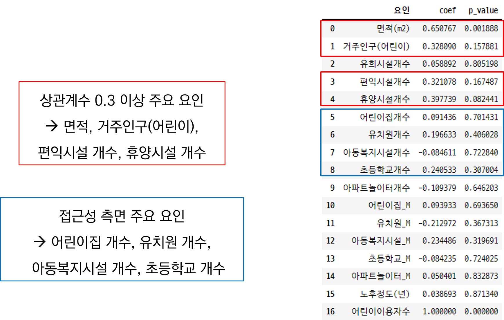
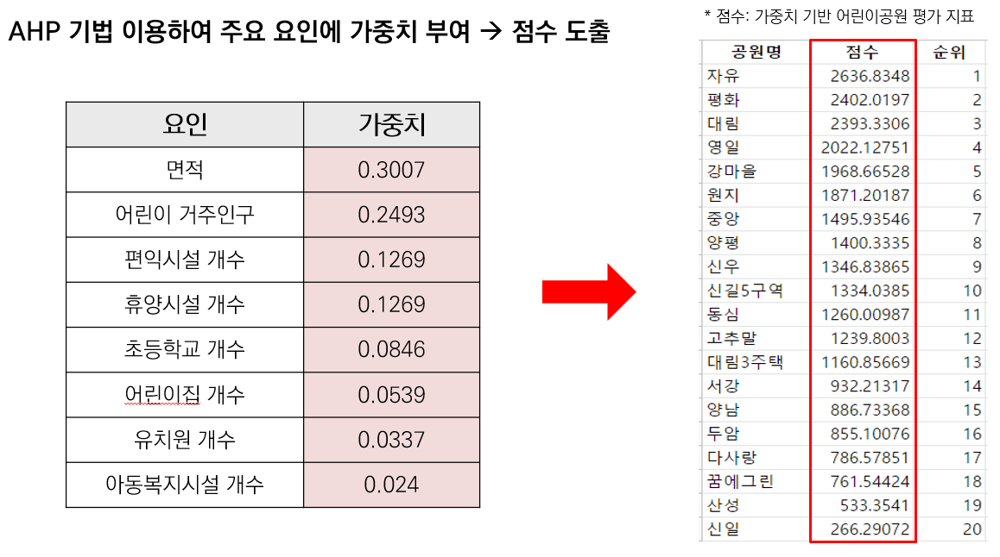

# 서울시 어린이공원 현황 분석 및 유지 여부 판단
기간 : 22.07.27~22.08.26

# 1. 팀 소개

이재은, 이종희, 임우석, 정세영, 정연지, 조성주

# 2. 프로젝트 목적

- 인구구조 변화 및 여가 활동 다변화에 따른 서울시 어린이공원 수요 감소
- 공원 주 이용자의 수요를 반영한 각 공원의 재정립 필요

# 3. 상관성 분석

- 어린이 이용자 수와의 주요 요인 도출

# 4. AHP 가중치

# 5. 분석 결과

- 최하위 3개의 공원은 공원 옆 분리수거장, 공원 펜스 옆 오토바이 및 자동차 주차 등 어린이가 공원을 이용에 불편함을 줄 수 있는 요소 존재

:point_right: [노션](https://www.notion.so/798a8b2e44d74521960405717bfd85d1?pvs=4) 자세한 내용
